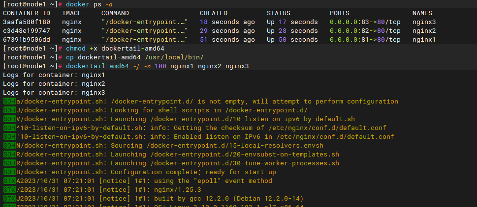
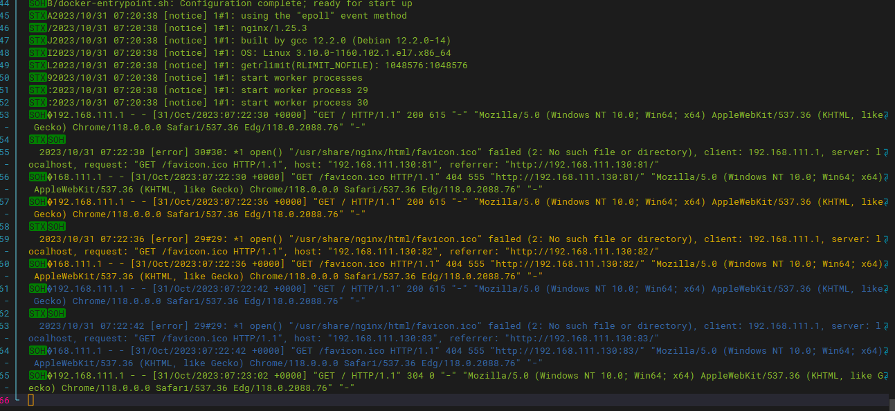

# dockertail

#### 介绍

实时查看多副本docker容器的工具。

#### 软件架构

软件架构说明

#### 安装教程

1. 安装golang环境

   安装golang 1.19.10
2. 安装依赖包

   ```
   go get github.com/docker/distribution/reference
   go get github.com/docker/go-connections/nat
   go get github.com/docker/go-connections/sockets
   go get github.com/docker/go-connections/tlsconfig
   go get github.com/docker/go-units
   go get github.com/gogo/protobuf/proto
   go get github.com/opencontainers/go-digest
   go get github.com/opencontainers/image-spec/specs-go/v1
   go get github.com/pkg/errors
   go get -u github.com/docker/docker
   go get github.com/fatih/color
   ```
3. 测试运行

   ```
   go run dockertail.go -f -n 100 副本1 副本2
   ```

#### 使用说明

1. 授权

   ```
   chmod +x dockertail
   ```
2. 拷贝到bin目录

   ```
   cp dockertail /usr/local/bin/
   ```
3. 运行

   ```
   dockertail -f -n nginx1 nginx2
   ```

#### 参与贡献

1. 欢迎提供PR与意见。

#### 说明

1. 此命令主要用于docker环境容器多副本的日志聚合，使用了颜色区分不同容器。

#### 示例




